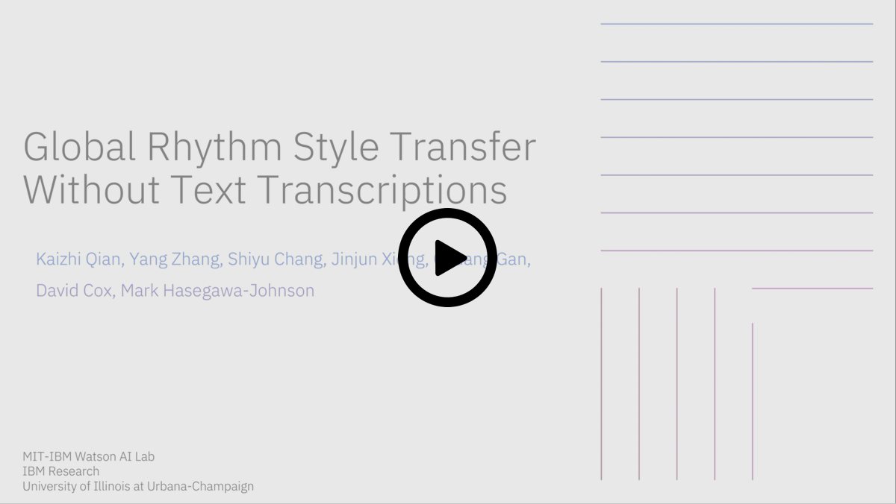

# Global Prosody Style Transfer Without Text Transcriptions

This repository provides a PyTorch implementation of [AutoPST](https://arxiv.org/abs/2106.08519), which enables unsupervised global prosody conversion without text transcriptions.

This is a short video that explains the main concepts of our work. If you find this work useful and use it in your research, please consider citing our paper.

[](https://youtu.be/wow2DRuJ69c/)

```
@InProceedings{pmlr-v139-qian21b,
  title = 	 {Global Prosody Style Transfer Without Text Transcriptions},
  author =       {Qian, Kaizhi and Zhang, Yang and Chang, Shiyu and Xiong, Jinjun and Gan, Chuang and Cox, David and Hasegawa-Johnson, Mark},
  booktitle = 	 {Proceedings of the 38th International Conference on Machine Learning},
  pages = 	 {8650--8660},
  year = 	 {2021},
  editor = 	 {Meila, Marina and Zhang, Tong},
  volume = 	 {139},
  series = 	 {Proceedings of Machine Learning Research},
  month = 	 {18--24 Jul},
  publisher =    {PMLR},
  url = 	 {http://proceedings.mlr.press/v139/qian21b.html}
}

```


## Audio Demo

The audio demo for AutoPST can be found [here](https://auspicious3000.github.io/AutoPST-Demo/)

## Dependencies
- Python 3.6
- Numpy
- Scipy
- PyTorch == v1.6.0
- librosa
- pysptk
- soundfile
- wavenet_vocoder ```pip install wavenet_vocoder==0.1.1```
  for more information, please refer to https://github.com/r9y9/wavenet_vocoder


## To Run Demo

Download [pre-trained models](https://drive.google.com/file/d/1ji3Bk6YGvXkPqFu1hLOAJp_SKw-vHGrp/view?usp=sharing) to ```assets```

Download the same WaveNet vocoder model as in [AutoVC](https://github.com/auspicious3000/autovc) to ```assets```

The fast and high-quality hifi-gan v1 (https://github.com/jik876/hifi-gan) pre-trained model is now available [here.](https://drive.google.com/file/d/1n76jHs8k1sDQ3Eh5ajXwdxuY_EZw4N9N/view?usp=sharing)

Please refer to [AutoVC](https://github.com/auspicious3000/autovc) if you have any problems with the vocoder part, because they share the same vocoder scripts.

Run ```demo.ipynb``` 


## To Train

Download [training data](https://drive.google.com/file/d/1H1dyA80qREKLHybqnYaqBRRsacIdFbnE/view?usp=sharing) to ```assets```.
The provided training data is very small for code verification purpose only.
Please use the scripts to prepare your own data for training.

1. Prepare training data: ```python prepare_train_data.py```

2. Train 1st Stage: ```python main_1.py```

3. Train 2nd Stage: ```python main_2.py```


## Final Words

This project is part of an ongoing research. We hope this repo is useful for your research. If you need any help or have any suggestions on improving the framework, please raise an issue and we will do our best to get back to you as soon as possible.
